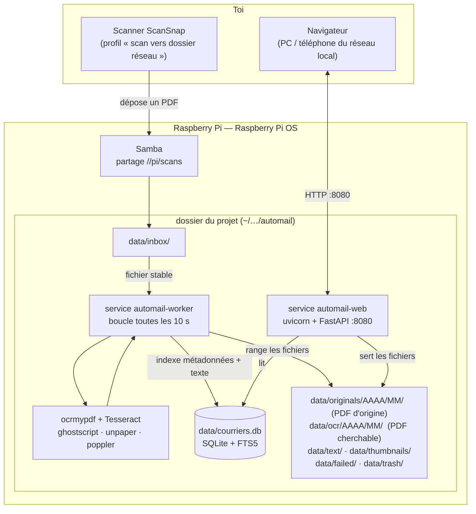
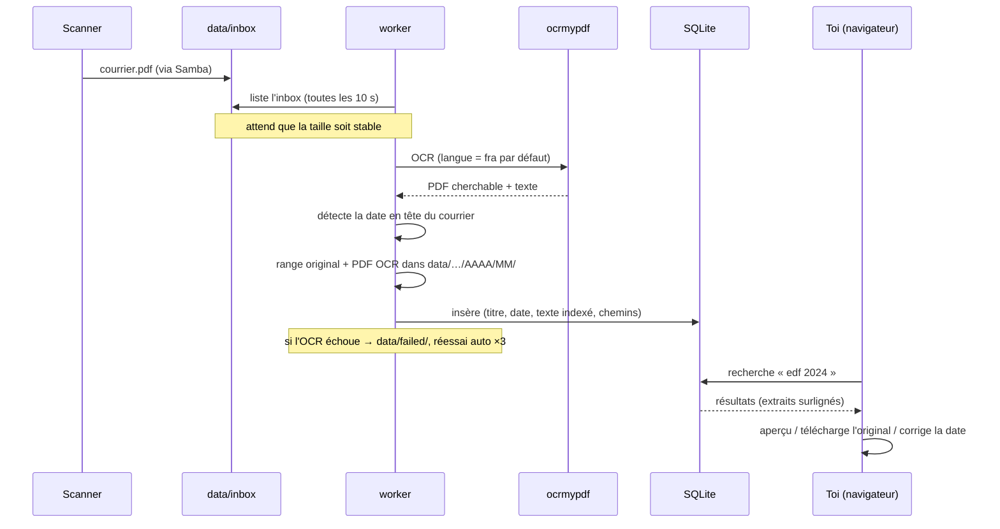

# AutoMail — banque de courriers OCR

Service auto-hébergé pour Raspberry Pi qui reproduit l'expérience ScanSnap Home,
en plus léger et sans PC allumé en permanence :

1. il **surveille un dossier** (`data/inbox/`) où le scanner dépose des PDF ;
2. à chaque nouveau courrier, il lance un **OCR** (`ocrmypdf` + Tesseract) qui
   produit un **PDF cherchable** (texte sélectionnable / surlignable) et extrait
   tout le texte ;
3. il **détecte automatiquement la date du courrier** (celle imprimée en haut),
   corrigeable dans l'interface ;
4. il **indexe** le texte pour la recherche plein-texte + avancement ;
5. il expose sur le réseau local une **API REST + une page web** pour chercher
   (mots-clés, plage de dates, avancement) et **télécharger l'original** ;
6. un courrier est **visible et téléchargeable dès sa réception**, avant même
   la fin de l'OCR ; un échec d'OCR est **retenté automatiquement** (×3).

Stack : Python + FastAPI + SQLite (FTS5). Deux services systemd, aucune base
externe, aucune dépendance réseau à l'exécution.

---

## Architecture



### Vie d'un courrier



### Ce qui vit où

Après installation, **tout est dans le dossier cloné** :

```
automail/
├── courriers_ocr/  web/  deploy/  …   ← le code (versionné)
├── .venv/          environnement Python        (ignoré par git)
├── .python/        Python 3.11 portable, si l'OS est trop vieux  (ignoré)
├── config.toml     configuration locale        (ignoré)
└── data/           inbox, originals, ocr, text, thumbnails,
                    failed, trash, courriers.db (ignoré)
```

Seule exception : 2 fichiers `*.service` dans `/etc/systemd/system/`, générés à
l'installation, qui pointent vers ce dossier. Sauvegarder = archiver le dossier.

---

## Matériel

- Raspberry Pi 4 / 5, 2 Go de RAM minimum ; un SSD USB est conseillé pour l'archive.
- OCR sur Pi 4 : ~10 à 40 s par page selon la qualité du scan.

## Installation

### 1. Récupérer le code

```bash
cd ~ && git clone https://github.com/MashiroW/AutoMail.git automail && cd automail
```

### 2a. Raspberry Pi OS Buster / Bullseye (OS ancien, Python < 3.10)

```bash
sudo bash deploy/bootstrap-pi-buster.sh
```

Script tout-en-un : bascule les dépôts Debian sur `archive.debian.org` (Buster
n'est plus signé) → installe `ocrmypdf` + Tesseract (fra/deu/ara) + poppler +
unpaper via l'apt de l'hôte → récupère un **Python 3.11 portable** (binaire, sans
compilation ; compilé en dernier recours) → crée `.venv/`, `data/`, `config.toml`
**dans ce dossier** → génère et démarre les 2 services → monte le partage Samba.

### 2b. Raspberry Pi OS Bookworm ou plus récent (Python ≥ 3.10 fourni)

```bash
sudo bash deploy/install.sh
sudo bash deploy/setup-samba.sh
```

### Après l'installation

```
Interface :   http://<ip-du-pi>:8080/
Dépôt scans : <dossier>/data/inbox/
Logs :        journalctl -u automail-worker -f      (et automail-web)
État :        systemctl status automail-worker automail-web
```

### Mettre à jour

```bash
cd ~/automail && git pull && sudo systemctl restart automail-worker automail-web
```

Relancer `sudo bash deploy/install.sh` seulement si `requirements.txt` change.

## Brancher le scanner

`deploy/setup-samba.sh` crée un partage Samba **invité** (sans mot de passe)
nommé `scans` qui pointe **exactement sur `<clone>/data/inbox`** — le dossier que
le worker surveille. Le fichier déposé par le scanner et le fichier attendu par
le programme sont le même. Le script est **idempotent** (le relancer réécrit le
bloc avec le bon chemin).

Il affiche le chemin réseau (`\\<ip-du-pi>\scans`) à mettre comme destination
« scan vers dossier » dans le logiciel du scanner. Sortie **PDF** simple (pas
« PDF cherchable » : c'est le Pi qui s'en charge), 300 dpi conseillé.

Sans Samba : tout ce qui écrit un `.pdf` dans `data/inbox` convient (Syncthing,
`scp`, montage NFS, clé USB…).

## Tester

```bash
cp un_scan.pdf data/inbox/
journalctl -u automail-worker -f
```

Au bout de ~10 s : `#1 indexé — … statut=ok`. Rafraîchir l'interface : le
courrier apparaît, cherchable.

## Interface web

- **Recherche mots-clés** : sur tout le texte OCR, insensible aux accents et à la
  casse, par préfixe (`convoc` trouve « convocation »).
- **Filtres** : date, **OCR** (menu gris : tous / traités / **non traités** /
  échecs), **Suivi** (pastilles colorées : tous / à faire / en cours / fait),
  tri. Les deux sont volontairement distincts — l'un concerne l'OCR, l'autre
  l'action à mener sur le courrier.
- **Avancement** : chaque courrier a une pastille de couleur — *à faire*,
  *en cours*, *fait* (défaut). Clic sur la pastille pour la faire tourner ;
  modifiable aussi dans la fiche *Modifier* et en groupe.
- **3 affichages** : liste / détail / tuiles (grandes vignettes), sélecteur en
  haut à droite, mémorisé.
- **Nombre par page** réglable en bas (25 à 200).
- **Mode sélection** : bouton *Sélectionner* → des cases apparaissent sur les
  cartes ; une barre propose alors les actions groupées : **télécharger en ZIP**,
  changer l'**avancement**, **corbeille** (ou, dans la corbeille : *restaurer* /
  *supprimer définitivement*). *Terminer* pour quitter le mode.
- **Corbeille** : icône dans la barre d'outils. *Restaurer*, *supprimer
  définitivement*, *vider la corbeille* — rien n'est effacé pour de bon avant ça.
- Chaque résultat : aperçu du PDF cherchable, **téléchargement de l'original**,
  fiche *Modifier* (toutes les infos + titre / date / avancement / notes),
  *Réessayer* pour un échec.
- Bandeau d'état : nombre de courriers, **en cours de traitement**, échecs,
  espace disque, **température CPU du Pi** (orange ≥ 70 °C, rouge ≥ 80 °C).
- Bouton **« Mise à jour »** : `git pull` depuis GitHub avec la console en
  direct, puis **« Redémarrer les services »** (sans privilège, relance via
  systemd), et invitation à recharger (Ctrl + Maj + R).
- Bouton 🌙 / ☀️ : thème clair / sombre (mémorisé).
- **Direction visuelle** commutable (sélecteur en en-tête) : *Nuit* (sombre,
  minimal), *Papier* (clair, éditorial), *Corporate* (structuré, clair/sombre).
- **Tableau de bord** (onglet en-tête) : indicateurs clés, volume de courriers
  par mois, répartition par avancement et par état OCR.
- Interface soignée : icônes SVG, écrans de chargement (skeletons), micro-
  animations (respecte `prefers-reduced-motion`), en-tête et barre d'outils
  collants.
- **La liste se rafraîchit toute seule** quand le contenu change (nouveau scan,
  OCR terminé…), sans perdre la position de lecture.

## Réglages — `config.toml`

Éditer `config.toml` dans le dossier, puis
`sudo systemctl restart automail-worker automail-web`.

- `ocr_languages` : `"fra"` par défaut. `"fra+deu"` si beaucoup d'allemand.
  Sinon, garder `fra` et faire un *Relancer l'OCR* ponctuel (fra / deu / ara)
  depuis la fiche d'un courrier.
- `ocr_extra_args` : `["--rotate-pages", "--deskew"]`. Ajouter `"--clean"`
  (nettoyage unpaper) seulement si les scans sont bruités — c'est gourmand en RAM.
- `ocr_output_type` : `"pdf"` (cherchable, léger, robuste) ou `"pdfa"`
  (archivistique ; conversion ghostscript plus lourde, à éviter sur un vieux
  système).
- `port`, `thumbnail_width`, `poll_interval_seconds`, `api_token`… — voir
  `config.example.toml` (commenté).

### Changer le dossier surveillé

Par défaut `data/inbox`. Pour un autre dossier, dans `config.toml` :

```toml
inbox_dir = "/chemin/vers/mon/dossier"
```

puis `sudo systemctl restart automail-worker`.

## Sauvegarde

```bash
sudo systemctl stop automail-worker
tar czf ~/automail-$(date +%F).tgz -C "$(dirname "$PWD")" "$(basename "$PWD")"
sudo systemctl start automail-worker
```

## Développement (sans Raspberry Pi)

`ocrmypdf` n'est pas requis : le **mode simulé** copie le PDF et lit un `.txt`
voisin comme « texte OCR ».

```bash
python -m venv .venv
.venv/Scripts/pip install -r requirements-dev.txt      # Windows
# ou : .venv/bin/pip install -r requirements-dev.txt

.venv/Scripts/python -m pytest

set COURRIERS_FAKE_OCR=1
set COURRIERS_DATA_DIR=.\data
.venv/Scripts/python -m courriers_ocr.worker           # terminal 1
.venv/Scripts/python -m courriers_ocr.serve            # terminal 2
```

Déposer `data/inbox/x.pdf` (+ éventuellement `data/inbox/x.txt`), puis ouvrir
`http://localhost:8080/`.

## Structure du code

| Fichier | Rôle |
|---|---|
| `courriers_ocr/config.py`  | configuration (TOML + variables d'env) |
| `courriers_ocr/db.py`      | SQLite, schéma, recherche FTS5 |
| `courriers_ocr/ocr.py`     | appel `ocrmypdf` (+ mode simulé) |
| `courriers_ocr/extract.py` | texte de repli, pages, vignette, langue probable |
| `courriers_ocr/dates.py`   | détection de la date du courrier (tolérante au bruit OCR) |
| `courriers_ocr/ingest.py`  | pipeline d'un PDF + retry d'un échec |
| `courriers_ocr/worker.py`  | boucle : inbox + retry auto + ré-OCR |
| `courriers_ocr/app.py`     | API REST + service de l'UI |
| `courriers_ocr/serve.py`   | lanceur uvicorn (lit host/port de la config) |
| `web/`                     | interface web (HTML/CSS/JS, sans build) |
| `deploy/`                  | `bootstrap-pi-buster.sh`, `install.sh`, `setup-samba.sh` |

## Sécurité

Pensé pour un réseau local de confiance : pas d'authentification par défaut.
Pour restreindre, définir `api_token` dans `config.toml` (les appels `/api/*`
exigent alors `Authorization: Bearer <token>` ou `?token=<token>`).
